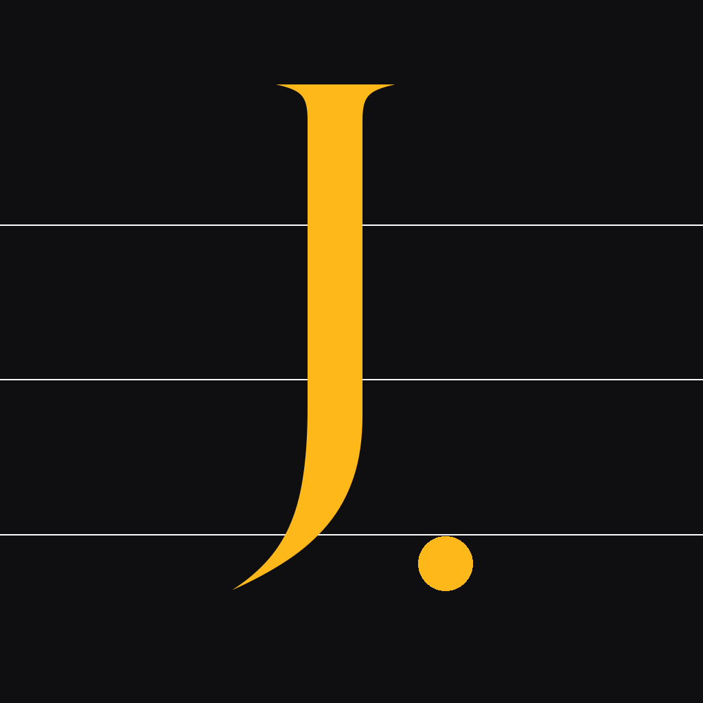

# Jot — Brand Assets

**Status:** baseline brand system, v1.
**Direction chosen:** Ledger (see [`visual-interface-mockups.md §1-2-6`](./visual-interface-mockups.md) and [`mockups/6_Ledger.swift`](./mockups/6_Ledger.swift)).
**Audience:** anyone shipping a new surface (icon, widget, watch face, marketing site) that needs to look like Jot instead of a generic iOS app.

---

## 1. Visual signature

A warm serif **`J.`** set on a dark ink ground, crossed by three hairline ledger rules.

- The serif (New York Bold) positions Jot as *written*, not *said-into-the-void*. This is a dictation app — the whole product is voice *becoming* print, and the mark says that in one letter.
- The trailing period is load-bearing. It reads as punctuation ("Jot." as a signature), it echoes the Ledger log's line-item completeness, and at 40×40 it's the last legible atom — pull it off the icon and you're left with just a J, which is generic.
- Three horizontal ledger rules sit behind the letter at ~7% white. At 1024 they anchor the J to a page; at 40 they dissolve into noise. That's the right fade.
- Amber accent (#FFB81A) rather than system red. Amber is the Ledger brand color and it's not owned by Nothing (or anyone else). On OLED dark it reads as "status" without the urgency of red.

**What we deliberately didn't do:**

- No waveform glyph. Every dictation app on the App Store uses one; a serif J at app-icon scale is the differentiator.
- No mic inside a circle. Same reason.
- No baked shadow, no bevel, no outer stroke. iOS masks to the squircle; we fill edge-to-edge.
- No committee compromise between "waveform AND serif AND mic AND dot." One confident mark.

---

## 2. Color tokens

All hex values are authoritative. Live in `Jot/Widget/JotLiveActivity.swift` as `enum JotBrand`; mirror in any new target.

| Token | Hex | RGB | Use |
|---|---|---|---|
| **Ink** | `#0F0F12` | `15, 15, 18` | App icon ground, Ledger surface ground, dark-mode chrome |
| **Amber** | `#FFB81A` | `255, 184, 26` | Primary accent: record-armed state, pill highlight, entry numbers, icon mark, Dynamic Island keyline |
| **Rule** | `rgba(255,255,255,0.07)` | — | Ledger horizontal rules behind entries and on the app icon |
| **Ink-soft** | `#161619` | — | Raised surfaces on ink ground (cards, hit rows) — derived, not baked into a token yet |

Semantic fallbacks (used where HIG wants the system to handle appearance):
- `Color(.systemBackground)` / `.label` / `.secondaryLabel` — all menus, settings, any surface that must also look right in a system light-mode regression test.
- `Color.red` for the record dot inside `StatusBadge`. Amber is the paint around the glass, red is still the bulb behind it. Don't break user muscle memory.

**Where the color code lives:**
- **SwiftUI:** `JotBrand.amber` in `Jot/Widget/JotLiveActivity.swift`. Import by name; don't inline-construct the Color.
- **Asset catalog:** none yet. If a future surface wants light/dark pairings, promote `JotBrand.amber` + `JotBrand.ink` to `Assets.xcassets/Colors/` as Color Sets and keep `JotBrand` as the Swift entry point.

---

## 3. Typography

**Brand surfaces** (icon, masthead, marketing):
- **New York Bold** (`NewYork.ttf`, shipped with macOS/iOS). Used for the icon's `J.`, for any promotional headline that needs to feel like a Ledger entry.
- Never use New York for UI labels smaller than 20pt — it's a display face and crushes at small sizes. SF Pro for that.

**Product UI** (per `mockups/6_Ledger.swift`):
- **SF Pro Rounded** for body transcript text — readable at every Dynamic Type size.
- **SF Mono** (via `.system(design: .monospaced)`) for the elapsed timer, session numbers (`#0042`), timestamps, status chips (`READY / REC / PROC`), and action buttons (`COPY` / `SHARE` / `DELETE`).
- Mono gets loose tracking when used as an all-caps label — instrument-panel vibe. Default tracking on mono body runs (there is none) is fine.

---

## 4. SF Symbols — per-intent cohort

The three Jot intents surface in Shortcuts, the Action Button picker, and Spotlight — they need to read as one app. All three use `waveform.*` variants:

| Intent | Symbol | Rationale |
|---|---|---|
| `RecordAndTranscribeIntent` (primary) | `waveform.badge.mic` | Mic badge on waveform = "captures via mic, outputs transcription." The primary-path semantic in one glyph. |
| `DictateIntent` (foreground fallback) | `waveform.and.mic` | Same cohort, mic made foreground-explicit — this intent brings the app to the front, so the mic is literally the handoff. |
| `TranscribeAudioFileIntent` | `waveform.badge.magnifyingglass` | Inspect-this-audio semantic: user points at a file, we return text. |

All three live in `Jot/App/Intents/JotAppShortcuts.swift`. If a new intent lands, pick a `waveform.*` variant; if you feel the urge to break the cohort, either the intent belongs to a different family (Settings, Help, etc.) or the cohort needs expansion — don't drop `waveform.*` for a one-off.

**Live Activity symbols** — `Jot/Widget/JotLiveActivity.swift`:
- `stop.fill` — interactive stop button in the expanded Dynamic Island region during `.recording`.
- `checkmark.circle.fill` — `.finished` / `.finishedCommand` terminal badge (kept green, iOS convention for success).
- Recording dot is a plain filled `Circle` tinted `Color.red` — intentional non-symbol, matches Voice Memos / QuickTime convention.
- Transcribing / cleaning use `ProgressView(.circular)` — the iOS-standard "work in progress" affordance.
- Dynamic Island `keylineTint` is amber (`JotBrand.amber`) rather than the historical `.red` — subtle Ledger-brand paint around the glass without touching the red bulb inside.

---

## 5. App icon — scale progression

Master is a single universal 1024×1024 PNG; iOS generates the smaller sizes on-device (Xcode 14+ single-size idiom, targeted here because `TARGETED_DEVICE_FAMILY: "1,2"` and `deploymentTarget: iOS 26.0` cover the modern rendering pipeline). Master lives at `Jot/Resources/Assets.xcassets/AppIcon.appiconset/icon-1024.png`.

| Size | Where it shows |
|---|---|
| **1024×1024** | App Store listing, macOS Launchpad at Retina, design reviews |
| **180×180** | iPhone home-screen (60pt @3x) |
| **120×120** | iPhone home-screen (60pt @2x) |
| **87×87** | iOS Settings (29pt @3x) |
| **80×80** | Spotlight (40pt @2x) |
| **40×40** | Spotlight (20pt @2x) — legibility floor |

**Previews** (rendered from the single master; iOS does the downscale):

| 1024 | 180 | 80 | 40 |
|---|---|---|---|
|  |  |  |  |

At 40, the ledger rules dissolve and the signature collapses to an amber `J.` on dark — which is what we wanted.

**Legibility floor:** if you're designing a derivative mark (watch face, widget icon, menu-bar extra), test at 32×32. If the serif reads as a rounded-sans blob, increase optical weight or drop the ledger rules. Do not drop the period; it's the recognition atom.

---

## 6. Regenerating the icon

Source of truth: [`~/workspace/agent-scripts/jot_icon.py`](/Users/tejasdc/workspace/agent-scripts/jot_icon.py). Python + Pillow, uses the system New York serif at `/System/Library/Fonts/NewYork.ttf`.

```
python3 ~/workspace/agent-scripts/jot_icon.py
cp ~/workspace/jot-mobile/tmp/icon-work/icon-1024.png \
   ~/workspace/jot-mobile/Jot/Resources/Assets.xcassets/AppIcon.appiconset/icon-1024.png
```

To refresh the scale-progression grid in this doc:

```
cd ~/workspace/jot-mobile/tmp/icon-work/
for sz in 1024 180 80 40; do
  sips -z $sz $sz icon-1024.png --out ~/workspace/jot-mobile/docs/design/brand-assets/grid-$sz.png
done
```

Pillow is a one-line install: `python3 -m pip install --user --break-system-packages Pillow`.

---

## 7. Out of scope (for now)

- **Watch complication** — serif-at-tiny-scale is unsolved. If/when Jot ships a watch target, design the complication from scratch; do not try to shrink this icon below 32.
- **Marketing tone voice** — brand voice is beyond this doc's remit.
- **Light-mode promoted tokens** — the current system is dark-first. If product adds a true light Ledger mode, add an `Ink-Light` and an `Amber-on-Light` here.
- **Illustration style** — none yet. If the website or onboarding grows illustrations, pick a single style (line-drawing at ink-and-amber) and add a section here.

---

## 8. File inventory

```
Jot/Resources/Assets.xcassets/AppIcon.appiconset/
  Contents.json          ← universal 1024×1024 entry
  icon-1024.png          ← the master
docs/design/brand-assets/
  grid-1024.png          ← scale-progression previews for this doc
  grid-180.png
  grid-80.png
  grid-40.png
docs/design/brand-assets.md   ← you are here
~/workspace/agent-scripts/jot_icon.py   ← icon generator
```
